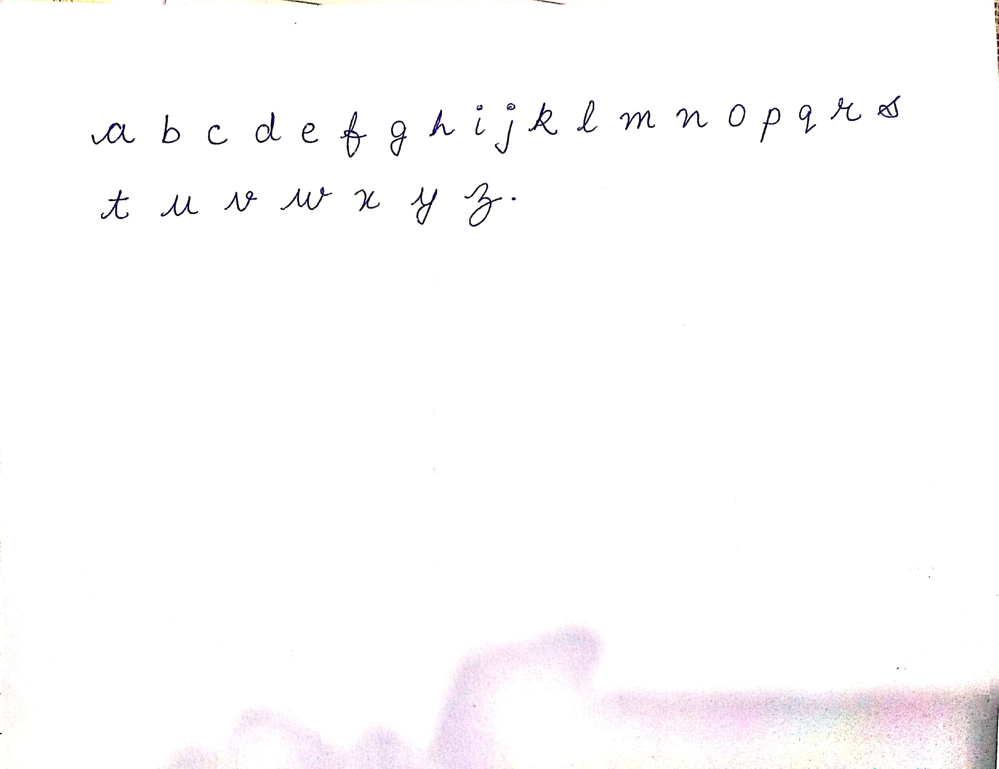

# Text-to-handwritting

We all get bored while writting our assignments so here i'm working on a model which can make your assignments.

THIS IS VERSION 1.0 

# Requirements
1. python3.x
2. pip install requests
3. pip install pillow

# Usage

Firstly take a image of your handwriting sample and copy the image to images/alphabets then crop all letter one by one and save them with their respective letter names.
Format of sample image is 

**Note- You have to change the save file name before running the programme and I mentioned it in issue section you can check there**

`Run python merged.py` 

# Contribution Guide 🌻

**The project is built with basic python you can make a web-app of this project using React or NODE JS and then Send a PR I will look into that and merge it if I find it suitable**

🐨 Local Setup
Fork this repository.
git clone https://github.com/ghanender-chauhan/Text-to-handwritting-OSF

`cd Text-to-handwriting-OSF`

`python pip install pillow`

🤗 Hello First-time Contributors
There are lot of resources (articles, courses, videos) available for getting started with git and GitHub you can search and follow any of the resource you like.

You can pick any of the issues from Issues or If you feel like it needs extra feature or if you find bug, you can create your own issue.
You can drop a comment on issue saying "Hi Ghanender, let me work on this " to avoid multiple people working on the same PR.
Lastly, It is fine if you mess something up. If there is anything wrong in the PR I will let you know how to fix that in comments of the PR.

## Web Version

### Site img

[Click Here](http://av1shek2.pythonanywhere.com/home/) to visit the site.
